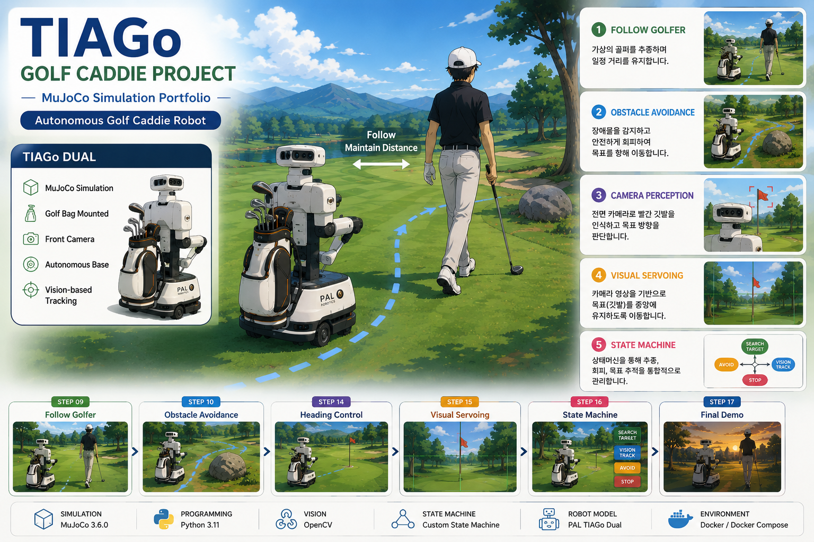

# ⛳ TIAGo Golf Caddie Project

<p align="center">
    
</p>

<h2 align="center">
Autonomous Golf Caddie Robot Simulation
</h2>

<p align="center">
MuJoCo • TIAGo Dual • OpenCV • Python
</p>

<p align="center">


</p>

---

# 📌 Overview

**TIAGo Golf Caddie Project**는 PAL Robotics의 **TIAGo Dual** 모델을 기반으로 **MuJoCo 시뮬레이션 환경**에서 자율 골프 캐디 로봇을 구현한 Robotics Portfolio Project입니다.

본 프로젝트는 실제 TIAGo 로봇을 사용하지 않고 **MuJoCo 기반 시뮬레이션**만을 대상으로 개발하였습니다.

모바일 서비스 로봇에서 사용되는 **Perception → Behavior → Controller** 구조를 기반으로 다음 기능들을 하나의 시스템으로 통합하였습니다.

- Autonomous Golfer Following
- Obstacle Avoidance
- Camera Rendering
- OpenCV Vision
- Camera Targeting
- Heading Controller
- Visual Servoing
- Vision-based State Machine
- Final Autonomous Demo

---

# ✨ Key Features

## 🤖 Robot

- TIAGo Dual Integration
- Mobile Robot Base
- Golf Bag Rack
- Golf Bag Mount

### 🚶 Navigation

- Golfer Following
- Safe Following Distance
- Obstacle Avoidance
- Target Controller

### 👀 Computer Vision

- Robot Front Camera
- MuJoCo Offscreen Rendering
- OpenCV Color Detection
- Golf Ball Detection
- Flag Detection
- Camera Targeting

### 🧠 Robot Intelligence

- Heading Controller
- Visual Servo Controller
- State Machine
- Vision State Machine

### 🚀 Integration

- Autonomous Demo
- Vision + Motion Integration
- Complete Simulation Pipeline

---

# 🏗 System Architecture

```text
                 MuJoCo Simulation

                         │

     ┌───────────────────┴───────────────────┐

     ▼                                       ▼

TIAGo Dual                          Golf Environment

                         │

                         ▼

====================================================

               Perception Layer

====================================================

FakeGolferTracker

ObstacleDetector

OpenCV Detection

CameraTargeting

                         │

                         ▼

====================================================

                Behavior Layer

====================================================

FollowBehavior

ObstacleAvoidance

CaddieStateMachine

                         │

                         ▼

====================================================

               Controller Layer

====================================================

DirectBaseController

HeadingController

VisualServoController

                         │

                         ▼

====================================================

         Autonomous Golf Caddie Robot
```

본 프로젝트는 **Perception → Behavior → Controller** 계층 구조를 기반으로 구현하였으며, 실제 모바일 서비스 로봇 소프트웨어의 구조를 참고하여 설계하였습니다.

---

# 🛠 Tech Stack

| Category | Technology |
|-----------|------------|
| Robot | PAL Robotics TIAGo Dual |
| Simulation | MuJoCo 3.6.0 |
| Programming | Python 3.11 |
| Vision | OpenCV |
| Rendering | MuJoCo Offscreen Rendering |
| Container | Docker / Docker Compose |
| Version Control | Git / GitHub |
| Platform | Windows |

---

# 📁 Project Structure

```text
tiago_golf_caddie_project/

├── docs/
│   └── images/
│
├── models/
│   ├── custom/
│   └── mujoco_menagerie/
│
├── src/
│   ├── behavior/
│   ├── controller/
│   ├── perception/
│   ├── vision/
│   └── main.py
│
├── tests/
├── scripts/
├── outputs/
│
├── Dockerfile
├── docker-compose.yml
├── requirements.txt
├── README.md
└── .gitignore
```

---

# 🚀 Quick Start

```powershell
git clone https://github.com/samuellee-dev/tiago_golf_caddie_project.git

cd tiago_golf_caddie_project

cd models

git clone https://github.com/google-deepmind/mujoco_menagerie.git

cd ..

docker compose build

docker compose up -d

docker compose exec tiago-golf-caddie bash
```
---

# 📈 Development Journey

본 프로젝트는 모든 기능을 한 번에 구현하는 방식이 아니라, 기능 단위로 개발 단계를 나누어 점진적으로 확장하며 구현하였습니다.

각 단계는 충분한 테스트와 검증을 완료한 후 다음 단계로 진행하여 안정적으로 시스템을 통합하였습니다.

| 단계 | 주요 개발 내용 |
|------|----------------|
| **Stage 1** | 개발 환경 구축 (Docker, MuJoCo, TIAGo Dual) |
| **Stage 2** | 골프장 환경 및 골프백 통합 |
| **Stage 3** | 모바일 로봇 이동 제어 구현 |
| **Stage 4** | 골퍼 추종 및 장애물 회피 |
| **Stage 5** | 카메라 렌더링 및 OpenCV 비전 |
| **Stage 6** | Heading Controller 및 Visual Servoing |
| **Stage 7** | Vision 기반 상태머신 통합 |
| **Stage 8** | 프로젝트 구조 정리 및 포트폴리오 문서화 |

프로젝트는 각 기능을 순차적으로 구현하고, 단계별 테스트와 검증을 반복하면서 최종적으로 하나의 자율 골프 캐디 시뮬레이션 시스템으로 완성하였습니다.

---

# 🎯 Implemented Features

- ✅ TIAGo Dual Simulation
- ✅ Custom Golf Course
- ✅ Golf Bag Mount
- ✅ Golfer Following
- ✅ Obstacle Avoidance
- ✅ Camera Rendering
- ✅ OpenCV Vision
- ✅ Camera Targeting
- ✅ Heading Controller
- ✅ Visual Servoing
- ✅ Vision State Machine
- ✅ Autonomous Demo

---

# 🔮 Future Work

현재 프로젝트는 **MuJoCo 기반 시뮬레이션**까지 구현하였습니다.

향후에는 다음과 같은 방향으로 확장할 수 있습니다.

```text
MuJoCo

    │

    ▼

ROS2

    │

    ▼

Gazebo

    │

    ▼

Real TIAGo Robot
```

Planned Extensions

- ROS2 Integration
- Navigation2
- SLAM
- YOLO Detection
- Manipulator Motion Planning
- Pick & Place
- Real Camera
- Real LiDAR

---

# 📚 References

- MuJoCo
- MuJoCo Menagerie
- PAL Robotics TIAGo
- OpenCV
- Docker
- Python

---

# 📄 License

본 프로젝트는 교육 및 학습을 목적으로 개발한 **로보틱스 시뮬레이션 포트폴리오**입니다.

프로젝트에서 사용된 외부 모델 및 에셋은 각 프로젝트의 라이선스를 따릅니다.

---

# 📝 Project Summary

본 프로젝트는 **PAL Robotics TIAGo Dual** 모델을 기반으로 **MuJoCo 시뮬레이션 환경**에서 자율 골프 캐디 로봇을 구현한 로보틱스 시뮬레이션 프로젝트입니다.

프로젝트에서는 다음과 같은 핵심 로보틱스 소프트웨어 기능을 하나의 시스템으로 통합하여 구현하였습니다.

- 모바일 로봇 이동 제어
- 컴퓨터 비전(OpenCV)
- 골퍼 추종 및 자율 주행
- 장애물 감지 및 회피
- 행동 계획(Behavior Planning)
- 상태머신(State Machine)
- Camera Targeting
- Heading Controller
- Visual Servoing

전체 소프트웨어는 **Perception → Behavior → Controller** 구조를 기반으로 설계하였으며, 모바일 서비스 로봇에서 널리 사용되는 계층형 소프트웨어 구조를 참고하여 구현하였습니다.

현재 프로젝트는 **MuJoCo 기반 시뮬레이션**을 목표로 완성하였으며, 향후에는 동일한 구조를 기반으로 **ROS2**, **Gazebo**, 그리고 **실제 TIAGo 로봇** 환경으로 확장할 수 있도록 설계하였습니다.

---

<p align="center">

읽어주셔서 감사합니다.

</p>